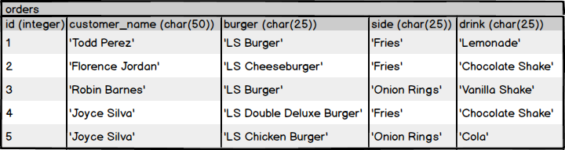

## SQL Basics Tutorial


SELECT:
```sql
SELECT side FROM orders; -- Selecting one column
SELECT drink, side FROM orders; -- Selecting two or more column
SELECT * FROM orders WHERE id = 1; -- Selecting rows
SELECT customer_name FROM orders WHERE side = 'Fries'; -- Selecting columns and rows
```

EXERCISES:
```sql
-- Write a query that returns all of the customer names from the orders table.
SELECT customer_name FROM orders;

-- Write a query that returns all of the orders that include a Chocolate Shake.
SELECT * FROM orders WHERE drink = 'Chocolate Shake';

--Write a query that returns the burger, side, and drink for the order with an id of 2.
SELECT burger, side, drink FROM orders WHERE id = 2;

--Write a query that returns the name of anyone who ordered Onion Rings.
SELECT customer_name FROM orders WHERE side = 'Onion Rings';
```

---
## CREATE AND VIEW DATABASES
We will be using Data Definition Language, or DDL, to create our database, since this deals with setting up the structure, or schema, of a database.

```
createdb sql_book           # creates a new database named sql_book
dropdb yet_another_database # delete the database, use with care
psql -d sql_book            # connect to it via psql console
\list                       # psql meta-command to list the databases
\c or \connect              # connect to a db
\c another_database
\q                          # quits psql session
```
Utility functions are executed from the terminal, while SQL statements are executed from within the psql console.

```sql
CREATE DATABASE another_database;
DROP DATABASE another_database;   -- Delete the DB
```

EXERCISES
```
createdb database_one # From the Terminal, create a database called database_one.
psql -d database_one  # From the Terminal, connect via the psql console to the database
\q                    # From the Terminal, delete the database_one and ls_burger databases.
dropdb database_one
dropdb ls_burger
```
```sql
CREATE DATABASE database_two; -- From the psql console, create a database called database_two
\c database_two               -- From the psql console, connect to database_two.
\connect database_two
\list                         -- Display all of the databases that currently exist.
\connect database_one         -- we first need to disconnect
DROP DATABASE database_two    -- From the psql console, delete database_two.
```
