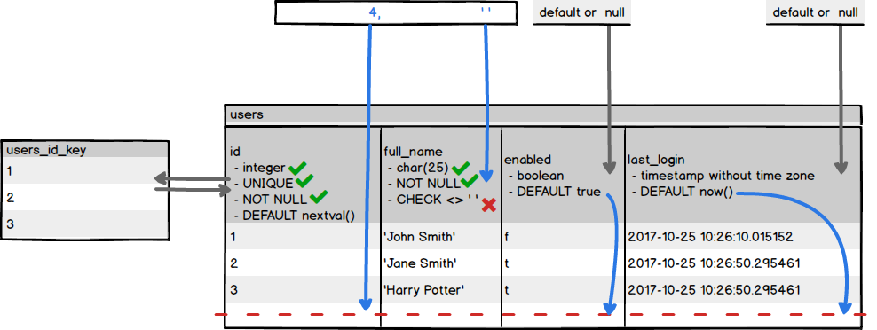
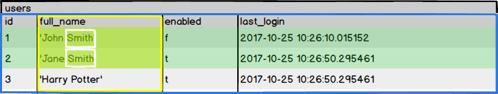
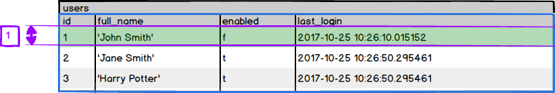
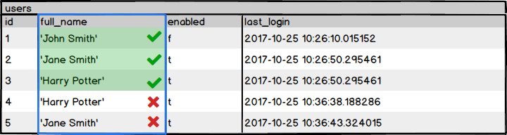
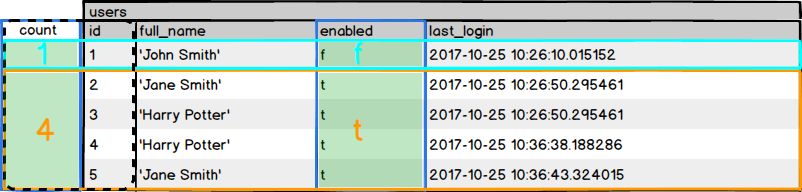

## SQL Basics Tutorial


SELECT:
```sql
SELECT side FROM orders; -- Selecting one column
SELECT drink, side FROM orders; -- Selecting two or more column
SELECT * FROM orders WHERE id = 1; -- Selecting rows
SELECT customer_name FROM orders WHERE side = 'Fries'; -- Selecting columns and rows
```

EXERCISES:
```sql
-- Write a query that returns all of the customer names from the orders table.
SELECT customer_name FROM orders;

-- Write a query that returns all of the orders that include a Chocolate Shake.
SELECT * FROM orders WHERE drink = 'Chocolate Shake';

--Write a query that returns the burger, side, and drink for the order with an id of 2.
SELECT burger, side, drink FROM orders WHERE id = 2;

--Write a query that returns the name of anyone who ordered Onion Rings.
SELECT customer_name FROM orders WHERE side = 'Onion Rings';
```

---
## CREATE AND VIEW DATABASES
We will be using Data Definition Language, or DDL, to create our database, since this deals with setting up the structure, or schema, of a database.

```
createdb sql_book           # creates a new database named sql_book
dropdb yet_another_database # delete the database, use with care
psql -d sql_book            # connect to it via psql console
\list                       # psql meta-command to list the databases
\c or \connect              # connect to a db
\c another_database
\q                          # quits psql session
```
Utility functions are executed from the terminal, while SQL statements are executed from within the psql console.

```sql
CREATE DATABASE another_database;
DROP DATABASE another_database;   -- Delete the DB
```

EXERCISES
```
createdb database_one # From the Terminal, create a database called database_one.
psql -d database_one  # From the Terminal, connect via the psql console to the database
\q                    # From the Terminal, delete the database_one and ls_burger databases.
dropdb database_one
dropdb ls_burger
```
```sql
CREATE DATABASE database_two; -- From the psql console, create a database called database_two
\c database_two               -- From the psql console, connect to database_two.
\connect database_two
\list                         -- Display all of the databases that currently exist.
\connect database_one         -- we first need to disconnect
DROP DATABASE database_two    -- From the psql console, delete database_two.
```
---
## CREATE AND VIEW TABLES
```sql
-- The basic format of a CREATE TABLE statement is:
CREATE TABLE table_name (
    column_1_name column_1_data_type [constraints, ...],
    column_2_name column_2_data_type [constraints, ...],
    .
    .
    .
    constraints
);

-- Creating a users table
CREATE TABLE users (
    id serial UNIQUE NOT NULL,   -- serial, char(25), boolean are datatypes
    username char(25),           -- UNIQUE, NOT NULL, are constraints
    enabled boolean DEFAULT TRUE -- DEFAULT TRUE, specifies a default value
);
```

```sql
\dt      -- meta-command to show us a list of all the tables, or relations, in the database.
\d users -- describe a table, to see information on the users table
```
```
Table "public.users"
  Column  |     Type      |  Modifiers
----------+---------------+----------------------------------------------------
 id       | integer       | not null default nextval('users_id_seq'::regclass)
 username | character(25) |
 enabled  | boolean       | default true
Indexes:
   "users_id_key" UNIQUE CONSTRAINT, btree (id)
```
- `users_id_key`; this index was created when we added the UNIQUE constraint.
- `serial` is a special data type.  It uses the integer data type along with a DEFAULT constraint and a function called nextval which keeps a track of the current highest value and increments this by one to be used as the next value. 

EXERCISES:
```
# From the Terminal, create a database called encyclopedia and connect to it via the psql console.
createdb encyclopedia
psql -d encyclopedia
```
```sql
-- Create a table called countries
CREATE TABLE countries (
  id serial,
  name varchar(50) UNIQUE NOT NULL,
  capital varchar(50) NOT NULL,
  population integer
);

-- Create a table called famous_people
CREATE TABLE famous_people (
  id serial,
  name varchar(100) NOT NULL,
  occupation varchar(150),
  date_of_birth varchar(50),
  deceased boolean DEFAULT false
);

-- Create a table called animals
CREATE TABLE animals (
  id serial,
  name varchar(100) NOT NULL,
  binomial_name varchar(100) NOT NULL,
  max_weight_kg decimal(8,3),
  max_age_years integer,
  conservation_status char(2) -- You could also use varchar for the conservation_status column. It is quite common to see char used when the length of the string in the column will always be the same. 
);

-- List all of the tables in the encyclopedia database.
\dt

-- Display the schema for the animals table.
\d animals

-- Create a database called ls_burger and connect to it.
CREATE DATABASE ls_burger
\c ls_burger

-- Create a table in the ls_burger database called orders.
CREATE TABLE orders (
  id serial,
  customer_name varchar(100) NOT NULL,
  burger varchar(50),
  side varchar(50),
  drink varchar(50),
  order_total decimal(4,2) NOT NULL
);
```

## ALTER A TABLE
Existing tables can be altered with an ALTER TABLE statement. An ALTER TABLE statement is part of DDL, and is for altering a table schema only.
```sql
ALTER TABLE table_to_change
    stuff_to_change_goes_here
    additional_arguments
```

```sql
-- Renaming a Table
ALTER TABLE users
  RENAME TO all_users;

-- Renaming a Column
ALTER TABLE all_users
  RENAME COLUMN username TO full_name;

-- Changing a Column's Datatype
ALTER TABLE all_users
  ALTER COLUMN full_name TYPE varchar(25);

-- Adding a Constraint
-- NOT NULL
ALTER TABLE table_name
  ALTER COLUMN column_name
  SET NOT NULL;
-- any other constraint:
ALTER TABLE table_name
  ADD [ CONSTRAINT constraint_name ]
  constraint_clause;

-- Removing a Constraint
ALTER TABLE table_name
  DROP CONSTRAINT constraint_name;
-- for default:
ALTER TABLE all_users
  ALTER COLUMN id
  DROP DEFAULT;

-- Adding a Column
ALTER TABLE all_users
  ADD COLUMN last_login timestamp NOT NULL DEFAULT NOW();

-- Removing a Column
ALTER TABLE all_users DROP COLUMN enabled;

-- Dropping Tables
DROP TABLE all_users;
```

EXERCISES:
```sql
-- Rename the famous_people table to celebrities.
ALTER TABLE famous_people RENAME TO celebrities;

-- Change the name of the name column in the celebrities table to first_name, and change its data type to varchar(80).
ALTER TABLE celebrities RENAME COLUMN name TO first_name;
ALTER TABLE celebrities ALTER COLUMN first_name TYPE varchar(80);

-- Create a new column in the celebrities table called last_name. It should be able to hold strings of lengths up to 100 characters. This column should always hold a value.
ALTER TABLE celebrities ADD COLUMN last_name varchar(100) NOT NULL;

-- Change the celebrities table so that the date_of_birth column uses a data type that holds an actual date value rather than a string. Also ensure that this column must hold a value.
ALTER TABLE celebrities
  ALTER COLUMN date_of_birth TYPE date
    USING date_of_birth::date,
  ALTER COLUMN date_of_birth SET NOT NULL;
-- We also need to add the USING clause to our statement altering the column's data type, since there is no implicit conversion (or cast) from the varchar data type to the date data type.

-- Change the max_weight_kg column in the animals table so that it can hold values in the range 0.0001kg to 200,000kg
ALTER TABLE animals
  ALTER COLUMN max_weight_kg TYPE decimal(10,4);

-- Change the animals table so that the binomial_name column cannot contain duplicate values.
ALTER TABLE animals
  ADD CONSTRAINTS unique_binomial_name UNIQUE
  (binomial_name);

```

```sql
ALTER TABLE orders
  ADD COLUMN customer_email varchar(50),
  ADD COLUMN customer_loyalty_points integer DEFAULT 0;

ALTER TABLE orders
  ADD COLUMN burger_cost decimal(4,2) DEFAULT 0,
  ADD COLUMN side_cost decimal(4,2) DEFAULT 0,
  ADD COLUMN drink_cost decimal(4,2) DEFAULT 0;

ALTER TABLE orders DROP COLUMN order_total;
```
---

## ADD DATA WITH INSERT

Insertion Statement Syntax
```sql
INSERT INTO table_name
            (column1_name, column2_name,...)
     VALUES (data_for_column1, data_for_column2, ...);
```

Adding Multiple Rows
```sql
INSERT INTO users (full_name)
           VALUES ('Jane Smith'), ('Harry Potter');
```

Check constraints:
Check constraints limit the type of data that can be included in a column based on some condition we set in the constraint. Each time a new record is in the process of being added to a table, that constraint is first checked to ensure that data being added conforms to it.
```sql
ALTER TABLE users ADD CHECK (full_name <> '');
```


EXERCISES:
```sql
INSERT INTO countries (name, capital, population)
  VALUES ('France', 'Paris', 67158000);

INSERT INTO countries (name, capital, population)
  VALUES
    ('USA', 'Washington D.C.', 325365189),
    ('Germany', 'Berlin', 82349400),
    ('Japan', 'Tokyo', 126672000);

INSERT INTO celebrities (first_name, last_name, occupation, date_of_birth, deceased)
              VALUES ('Bruce', 'Springsteen', 'Singer, Songwriter', '1949-09-23', false);

INSERT INTO celebrities (first_name, last_name, occupation, date_of_birth)
                 VALUES ('Scarlett', 'Johansson', 'Actress', '1984-11-22');

INSERT INTO celebrities (first_name, last_name, occupation, date_of_birth, deceased)
                VALUES ('Frank', 'Sinatra', 'Singer, Actor', '1915-12-12', true),
                       ('Tom', 'Cruise', 'Actor', '1962-07-03', DEFAULT);

ALTER TABLE celebrities
  ALTER COLUMN last_name DROP NOT NULL; -- removes the NOT NULL constraint

```
---

## SELECT QUERIES

```sql
SELECT column_name, ...
  FROM table_name
  WHERE condition;
```

Order by
```sql
SELECT column_name, ...
       FROM table_name
       WHERE condition
       ORDER BY column_name;

SELECT full_name, enabled FROM users
ORDER BY enabled DESC; -- order descending

SELECT full_name, enabled FROM users
ORDER BY enabled DESC, id DESC; -- fine tune ordering

SELECT full_name, enabled, last_login
       FROM users
       WHERE id >= 2;

SELECT * FROM my_table WHERE my_column IS NULL;

SELECT * FROM users
         WHERE full_name = 'Harry Potter'
            OR enabled = 'false';

SELECT * FROM users
         WHERE full_name = 'Harry Potter'
           AND enabled = 'false';
```

String matching:
```sql
SELECT * FROM users WHERE full_name LIKE '%Smith';
```


Note that LIKE is case sensitive: LIKE %Smith matches Smith but not smith or SMITH. If you want a case-insensitive selection, you can use `ILIKE %Smith`.

As well as the % character, the underscore _ can also be used as a wildcard with LIKE and ILIKE. However, _ stands in for only a single character whereas % stands in for any number of characters.

EXERCISES:
```sql
SELECT first_name, last_name
FROM celebrities
WHERE deceased != true
OR deceased IS NULL;

SELECT first_name, last_name
FROM celebrities
WHERE occupation LIKE '%Singer%';

SELECT first_name, last_name
FROM celebrities
WHERE occupation LIKE '%Actor%'
OR occupation LIKE '%Actress%';

SELECT first_name, last_name
FROM celebrities
WHERE (occupation LIKE '%Actor%' OR occupation LIKE '%Actress%')
AND occupation LIKE '%Singer%';

SELECT burger, side, drink
FROM orders
WHERE side != 'Fries'
OR side IS NULL;

SELECT burger, side, drink
FROM orders
WHERE side IS NOT NULL
AND drink IS NOT NULL;
```

## MORE ON SELECT

LIMIT AND OFFSET
```sql
SELECT * FROM users LIMIT 1;
```

```sql
SELECT * FROM users LIMIT 1 OFFSET 1;
```
```sql
SELECT topic, author, publish_date, category,
       replies_count, likes_count, last_activity_date
    FROM posts
    LIMIT 12
    OFFSET 12;
```

DISTINCT
example:
```
id |  full_name   | enabled |         last_login
----+--------------+---------+----------------------------
 1 | John Smith   | f       | 2017-10-25 10:26:10.015152
 2 | Jane Smith   | t       | 2017-10-25 10:26:50.295461
 3 | Harry Potter | t       | 2017-10-25 10:26:50.295461
 4 | Harry Potter | t       | 2017-10-25 10:36:38.188286
 5 | Jane Smith   | t       | 2017-10-25 10:36:43.324015
(5 rows)
```
```sql
SELECT DISTINCT full_name FROM users;
```
```
 full_name
--------------
 John Smith
 Jane Smith
 Harry Potter
(3 rows)
```


DISTINCT can be useful when used in conjunction with SQL functions. Compare, for example, the results of the following two queries using the count() function:
```sql
SELECT count(full_name) FROM users;
```
```
 count
-------
     5
(1 row)
```
```sql
SELECT count(DISTINCT full_name) FROM users;
```
```
 count
-------
     3
(1 row)
```

### Functions
String Functions
Date/Time Functions
Aggregate Functions

### Group By
```sql
SELECT enabled, count(id) FROM users GROUP BY enabled;
```

```
 enabled | count
---------+-------
 f       |     1
 t       |     4
(2 rows)
```

EXERCISES:
```sql
SELECT * FROM countries LIMIT 1;
SELECT name FROM countries 
    ORDER BY population DESC
    LIMIT 1;

SELECT name FROM countries
    ORDER BY population DESC
    LIMIT 1 OFFSET 1;

SELECT DISTINCT binomial_name
    FROM animals;

SELECT binomial_name
    FROM animals
    ORDER BY length(binomial_name) DESC
    LIMIT 1;

SELECT first_name
    FROM celebrities
    WHERE date_part('year', date_of_birth) = 1958;

SELECT max(max_age_years) FROM animals;

SELECT avg(max_weight_kg) FROM animals;

SELECT count(id) FROM countries;

SELECT sum(population) FROM countries;

SELECT conservation_status, count(id)
    FROM animals
    GROUP BY conservation_status;

SELECT avg(burger_cost)
    FROM orders
    WHERE side = 'Fries';

SELECT min(side_cost)
    FROM orders
    WHERE side IS NOT NULL;
-- or
SELECT side_cost FROM orders
    WHERE side IS NOT NULL
    ORDER BY side_cost ASC LIMIT 1;

SELECT side, count(id)
    FROM orders
    WHERE side = 'Fries'
    OR side = 'Onion Rings'
    GROUP BY side;

```
---

## Update Data in a Table

```sql
UPDATE table_name
SET column_name = value, ...
WHERE expression;
```

```sql
UPDATE users SET enabled = false; -- UPDATE all rows
UPDATE users SET enabled = true   -- Update specific rows
             WHERE full_name = 'Harry Potter'
                OR full_name = 'Jane Smith';
UPDATE users SET full_name='Alice Walker' WHERE id=2;
```

Deleting Data
```sql
DELETE FROM table_name WHERE expression;
```

```sql
DELETE FROM users
    WHERE full_name='Harry Potter' AND id > 3; -- delete specific rows
DELETE FROM users;
```

EXERCISES:
```sql
ALTER TABLE animals ADD COLUMN class varchar(100);
UPDATE animals SET class = 'Aves';

ALTER TABLE animals
    ADD COLUMN phylum varchar(100),
    ADD COLUMN kingdom varchar(100);
UPDATE animals
    SET phylum = 'Chordata', kingdom = 'Animalia';

ALTER TABLE countries
    ADD COLUMN continent varchar(50);
UPDATE countries
    SET continent = 'North America'
    WHERE name = 'USA';
UPDATE countries
    SET continent = 'Asia'
    WHERE name = 'Japan';
UPDATE countries
    SET continent = 'Europe'
    WHERE name = 'France' OR name = 'Germany';

UPDATE celebrities
    SET deceased = true
    WHERE first_name = 'Elvis';
ALTER TABLE celebrities
    ALTER COLUMN deceased
    SET NOT NULL;

DELETE FROM celebrities
    WHERE first_name = 'Tom'
    AND last_name = 'Cruise';

ALTER TABLE celebrities RENAME TO singers;
SELECT * FROM singers
    WHERE occupation
    NOT LIKE '%Singer%';
DELETE FROM singers -- It is prudent before deleting data, especially with a more complex condition, to run a SELECT query first to ensure that the WHERE clause is targeting the correct rows.
    WHERE occupation
    NOT LIKE '%Singer%';

DELETE FROM countries;

UPDATE orders
    SET drink = 'Lemonade'
    WHERE id = 1;

UPDATE orders
    SET side = 'Fries',
    side_cost= 0.99,
    customer_loyalty_points = 13
    WHERE id = 4;

UPDATE orders
    SET side_cost = 1.20
    WHERE side = 'Fries';
```