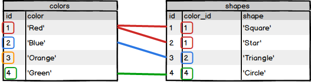
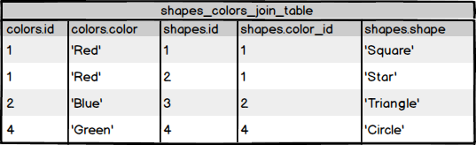

KEYS
```sql
ALTER TABLE users ADD PRIMARY KEY (id);

FOREIGN KEY (fk_col_name)
REFERENCES target_table_name (pk_col_name);
```

One-to-One
```sql
/*
one-to-one: User has one address
*/

CREATE TABLE addresses (
  user_id int, -- Both a primary and foreign key
  street varchar(30) NOT NULL,
  city varchar(30) NOT NULL,
  state varchar(30) NOT NULL,
  PRIMARY KEY (user_id),
  FOREIGN KEY (user_id)
      REFERENCES users (id)
      ON DELETE CASCADE
);
```

One-to-Many
```sql
CREATE TABLE books (
  id serial,
  title varchar(100) NOT NULL,
  author varchar(100) NOT NULL,
  published_date timestamp NOT NULL,
  isbn char(12),
  PRIMARY KEY (id),
  UNIQUE (isbn)
);

/*
 one-to-many: Book has many reviews
*/

CREATE TABLE reviews (
  id serial,
  book_id integer NOT NULL,
  reviewer_name varchar(255),
  content varchar(255),
  rating integer,
  published_date timestamp DEFAULT CURRENT_TIMESTAMP,
  PRIMARY KEY (id),
  FOREIGN KEY (book_id)
      REFERENCES books(id)
      ON DELETE CASCADE
);
```

Many-to-Many
```sql
CREATE TABLE checkouts (
  id serial,
  user_id int NOT NULL,
  book_id int NOT NULL,
  checkout_date timestamp,
  return_date timestamp,
  PRIMARY KEY (id),
  FOREIGN KEY (user_id) REFERENCES users(id)
                        ON DELETE CASCADE,
  FOREIGN KEY (book_id) REFERENCES books(id)
                        ON DELETE CASCADE
);
```


EXERCISES:
```sql
CREATE TABLE continents (
  id serial PRIMARY KEY,
  continent_name varchar(50)
);

CREATE TABLE continents (
id serial PRIMARY KEY,
continent_name varchar(50)
);

ALTER TABLE countries
DROP COLUMN continent;

ALTER TABLE countries
ADD COLUMN continent_id integer;

ALTER TABLE countries
ADD FOREIGN KEY (continent_id)
REFERENCES continents(id);
```

Join Syntax:
```sql
SELECT table_nameN.column_name, ...
       FROM table_name1
       join_type JOIN table_name2
                 ON join_condition;
```
example:

```sql
SELECT colors.color, shapes.shape
       FROM colors
       JOIN shapes
            ON colors.id = shapes.color_id;
```

```sql
SELECT colors.color, shapes.shape
       FROM shapes_colors_join_table;
```